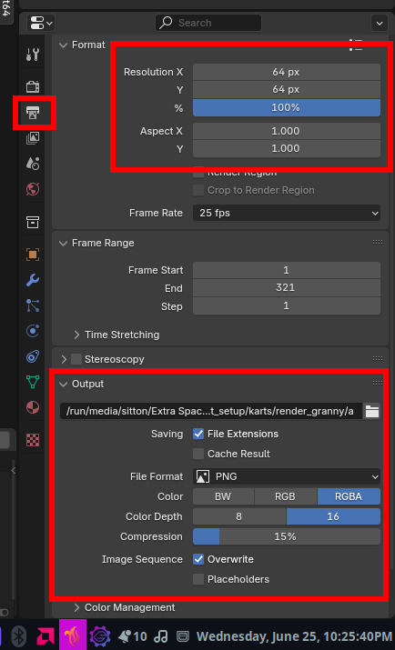

# Custom characters
Custom characters can only replace existing characters for now.

1. Download the Kart Setup blender file included with this post(Slightly altered .blender file provided by the Overkart server with some adjustments to the animation to export for Spaghetti, thanks again Andrat for permission to post this and a huge thanks to the Overkart 64 community in general.) [Kart Setup.blend](MK64_Spaghetti_Adjusted_Kart_Setup.blend)
2. Replace Mario with your character, and handle weights of the skeleton as needed to make them move properly.
3. Set the path a valid one(the included path is what Andrat had setup for his original kart setup) but make sure the name matches a listed kart name below and ends with ###, this will ensure it is 3 digits(example path/to/export/toad_kart/toad_kart_frame###)
4. Render the animation at whatever power of 2 of 64x64 you want(64x64, 128x128, 256x256 and so on),
5. In the above toad example, zip up the toad_kart folder and rename it to a .o2r file.
6. Put it in mods folder and run.

# Examples for all characters:
mario_kart/mario_kart_frame###

luigi_kart/luigi_kart_frame###

peach_kart/peach_kart_frame###

wario_kart/wario_kart_frame###

toad_kart/toad_kart_frame###

donkeykong_kart/donkeykong_kart_frame###

bowser_kart/bowser_kart_frame###

yoshi_kart/yoshi_kart_frame###

# Additional Files
Some other files to look out for(still using toad as a example)

placement icon = common_data/common_texture_portrait_toad.png Original frame is 32x32

player selection frames = player_selection/toad_face_00.png ~ toad_face_16.png Original frames is 64x64 (note that Donkeykong uses donkey_kong here instead)

player select nameplate = texture_tkmk00/gTextureNameToad.png Original frame is 64x12 (note that Donkeykong uses DK here instead) 

## Tips
### Change Viewport Render Settings
Assuming your using the overkart setup kart.

In object mode, select View -> Cameras -> Active Camera

Set your render resolution and path as shown in the image below 

Then render your animation by selecting View -> Viewport Render Animation

## Tools To Help
* There is [Racer Ready-Up](https://vinievex.itch.io/racer-ready-up) which is a tool to help you create custom characters for SpaghettiKart.

## Future plans
* Support for custom characters that do not replace existing ones.
* Support 3d models for characters.